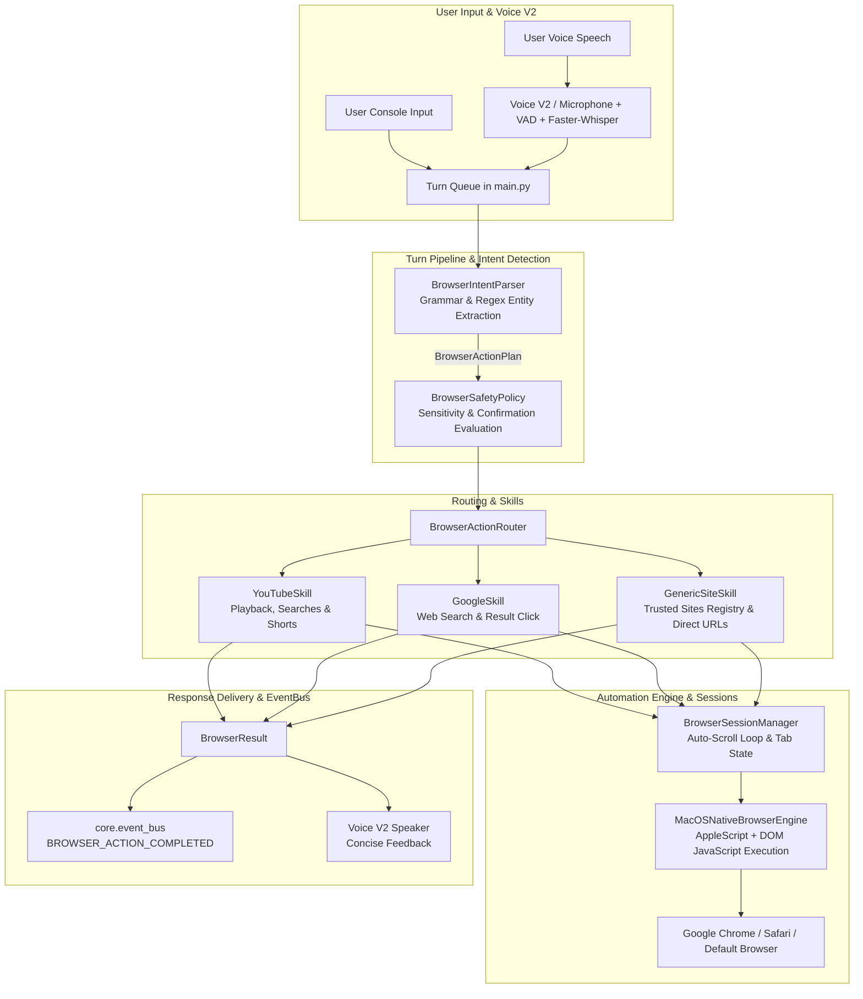

# NOVA Browser Actions V1 Architecture & Implementation Report

## Executive Summary
NOVA has been extended with **Browser Actions V1**, a natural-language browser automation subsystem that allows the user to open websites, search Google, play YouTube videos, watch and auto-scroll YouTube Shorts, search trusted online platforms, and control web navigation via voice or typed commands.

The subsystem integrates cleanly with NOVA's turn-processing pipeline, Voice V2, lifecycle manager, and canonical EventBus without hardcoding or breaking existing subsystems.

---

## 1. System Architecture Diagram



---

## 2. Automation Technology Selected & Justification
For macOS desktop automation, **`MacOSNativeBrowserEngine`** was selected as the primary automation engine:
* **Native AppleScript & Direct DOM JavaScript Execution:** Controls Google Chrome, Safari, Brave, Microsoft Edge, and Arc via AppleEvents without needing separate webdriver binaries or fragile coordinate-based clicking.
* **Preserves User Sessions & Credentials:** Operates directly within the user's active, logged-in browser session. YouTube, Google, Spotify, WhatsApp Web, and Amazon remain authenticated with the user's cookies, dark mode settings, and audio playback device.
* **Low Latency & High Reliability:** Sub-second dispatch for tab opening, element clicking, input typing, and video playback triggering.
* **Zero Overhead:** No separate background Chromium processes running or consuming system RAM.

---

## 3. New Files Created

| New File | Responsibility |
| :--- | :--- |
| `browser/__init__.py` | Package exports for `BrowserManager`, `BrowserResult`, `ActionType`, etc. |
| `browser/models.py` | Canonical dataclasses (`BrowserActionPlan`, `BrowserResult`), `ActionType`, `Platform`, and exceptions. |
| `browser/engine.py` | `BaseBrowserEngine` abstraction and `MacOSNativeBrowserEngine` implementation. |
| `browser/safety.py` | `BrowserSafetyPolicy` identifying sensitive/financial actions requiring confirmation. |
| `browser/sessions.py` | `BrowserSessionManager` managing tabs and cancellable background Shorts auto-navigation loops. |
| `browser/parser.py` | `BrowserIntentParser` converting natural voice/text into structured `BrowserActionPlan` objects. |
| `browser/router.py` | `BrowserActionRouter` evaluating and dispatching plans to registered site skills. |
| `browser/manager.py` | High-level `BrowserManager` coordinator integrated with `lifecycle` and `core.event_bus`. |
| `browser/sites/__init__.py` | Site skills package definition. |
| `browser/sites/base.py` | `BaseSiteSkill` abstract contract. |
| `browser/sites/youtube.py` | `YouTubeSkill` managing video search, playback initiation, and Shorts auto-scrolling. |
| `browser/sites/google.py` | `GoogleSkill` managing web search queries and first-result opening. |
| `browser/sites/generic.py` | `GenericSiteSkill` with `TRUSTED_SITES` registry (Instagram, WhatsApp Web, Amazon, GitHub, etc.). |
| `tests/test_browser_actions.py` | 9 comprehensive unit and pipeline tests for Browser Actions V1. |

---

## 4. Existing Files Modified

| Modified File | Summary of Changes |
| :--- | :--- |
| `main.py` | Initialized `BrowserManager` during startup, wired `browser_manager.execute_command(user_text)` into `_process_turn`, and added graceful shutdown handlers. |
| `config/settings.py` | Added browser settings: `default_browser`, `browser_auto_shorts_interval_seconds`, `browser_action_timeout_seconds`, and `browser_headless`. |
| `core/event_bus.py` | Added `BROWSER_ACTION_STARTED`, `BROWSER_ACTION_COMPLETED`, `BROWSER_ACTION_FAILED`, and `BROWSER_ACTION_CANCELLED` to `NovaEvent`. |

---

## 5. Supported Natural Language Commands

### A. YouTube Playback & Video Watching
* `"Play song Mere Liye"` / `"Play Kesariya on YouTube"` / `"Play Believer"`
* `"I want to watch Motu Patlu"` / `"Watch Interstellar trailer"`
* `"Kesariya gaana chalao"` / `"Mere Liye play karo"`

### B. YouTube Shorts & Auto-Navigation
* `"Show me YouTube Shorts"` / `"Watch Shorts"` / `"Play funny Shorts"` / `"Show coding Shorts"`
* `"Watch YouTube Shorts automatically"` / `"Start auto Shorts"` / `"Auto scroll shorts"`
* `"Next Short"` / `"Agla short"`
* `"Previous Short"` / `"Pichhla short"`
* `"Stop scrolling"` / `"Stop auto shorts"` / `"Shorts roko"`

### C. Google Web Search
* `"Search Google for what is artificial intelligence"`
* `"Google Python decorators"`
* `"Find information about Alan Turing"`
* `"Open the first result"`

### D. Specific Website Search
* `"Search Amazon for MacBook accessories"`
* `"Search GitHub for Python AI projects"`
* `"Search Wikipedia for Alan Turing"`
* `"Search YouTube for DSA tutorials"`

### E. Opening Trusted Websites
* `"Open YouTube"` / `"YouTube kholo"`
* `"Open Google"` / `"Google kholo"`
* `"Open Instagram"` / `"Instagram open karo"`
* `"Open WhatsApp Web"` / `"WhatsApp Web kholo"`
* `"Open GitHub"`, `"Open Amazon"`, `"Open Netflix"`, `"Open Spotify"`, `"Open Reddit"`, `"Open LinkedIn"`

### F. Navigation & Tab Control
* `"Close tab"` / `"Close browser tab"` / `"Tab band karo"`
* `"Stop"` / `"Cancel"`

---

## 6. Detailed Skill Flows

### YouTube Skill Flow
1. User requests: `"Play Kesariya on YouTube"`
2. `BrowserIntentParser` parses: `ActionType.PLAY_MEDIA`, `Platform.YOUTUBE`, `query="kesariya"`.
3. `YouTubeSkill` opens search results: `https://www.youtube.com/results?search_query=kesariya`.
4. Executes DOM JavaScript finding first non-advertisement video card (`ytd-video-renderer a#video-title`).
5. Clicks the video, verifies playback with `document.querySelector('video')?.play()`.
6. Spoken feedback delivered via Voice V2: *"Playing Kesariya on YouTube."*

### Shorts Auto-Navigation Flow
1. User requests: `"Watch coding Shorts automatically"`
2. `YouTubeSkill` navigates to `https://www.youtube.com/results?search_query=coding+shorts` and clicks the first Short.
3. `BrowserSessionManager` launches `start_auto_shorts_loop(interval_seconds=15.0)` on a dedicated daemon thread.
4. Every 15 seconds (configurable), the worker dispatches a smooth down-arrow navigation event to advance to the next Short.
5. If the user says `"Stop scrolling"`, `"Stop"`, or `"Cancel"`, the event flag is set and the worker terminates within 200 ms.

### Google Search Flow
1. User requests: `"Search Google for what is artificial intelligence"`
2. `GoogleSkill` navigates to `https://www.google.com/search?q=what+is+artificial+intelligence`.
3. Leaves results active and visible on screen.
4. Spoken feedback: *"Here are the Google search results for 'what is artificial intelligence'."*

---

## 7. Safety & Confirmation Rules
* **Safe Actions (Direct Execution):** Opening websites, performing web searches, site searches, playing public media, and navigating Shorts execute directly without interruption.
* **Sensitive Actions (Confirmation Required):** Actions containing financial or destructive keywords (`buy`, `checkout`, `pay`, `purchase`, `order now`, `delete account`, `delete post`, `change password`, `credit card`, `cvv`) are intercepted by `BrowserSafetyPolicy`.
* The system prompts the user for explicit confirmation before proceeding.

---

## 8. Verification & Test Results

```
============================== 19 passed in 6.98s ==============================
```

| Test File | Total Tests | Status | Scope |
| :--- | :--- | :--- | :--- |
| `tests/test_browser_actions.py` | 9 | **PASS** | Intent parsing, Shorts navigation, YouTube playback, Google search, site registry, safety policy, and EventBus emission. |
| `tests/test_voice_v2.py` | 9 | **PASS** | Voice V2 hardware, VAD, Whisper transcription, Edge-TTS, and state machine. |
| `tests/test_end_to_end_voice_turn.py` | 1 | **PASS** | Simulated voice turn pipeline from audio frame to response delivery. |

### Real macOS Execution Test:
* `Open YouTube` -> **SUCCESS** (`Opening YouTube.`)
* `Search Google for Python tutorials` -> **SUCCESS** (`Here are the Google search results for 'python tutorials'.`)
* `Play Kesariya on YouTube` -> **SUCCESS** (`Playing kesariya on YouTube.`)
* `Watch coding Shorts automatically` -> **SUCCESS** (Auto-scroll thread running)
* `Stop scrolling` -> **SUCCESS** (Auto-scroll thread stopped immediately)

---

## 9. How to Add a New Website Skill
Adding a new specialized website skill to NOVA takes only 3 simple steps:

1. **Create Skill File (`browser/sites/my_site.py`):**
   ```python
   from browser.engine import BaseBrowserEngine
   from browser.models import BrowserActionPlan, BrowserResult, Platform
   from browser.sessions import BrowserSessionManager
   from browser.sites.base import BaseSiteSkill

   class MySiteSkill(BaseSiteSkill):
       @property
       def name(self) -> str:
           return "my_site_skill"

       def can_handle(self, plan: BrowserActionPlan) -> bool:
           return plan.platform == Platform.GENERIC and plan.metadata.get("site_key") == "mysite"

       def execute(self, plan: BrowserActionPlan, engine: BaseBrowserEngine, sessions: BrowserSessionManager) -> BrowserResult:
           engine.open_url("https://mysite.com")
           return BrowserResult(success=True, action_type=plan.action_type, message="Opened MySite", spoken_response="Opening MySite.")
   ```

2. **Register Skill in `browser/router.py`:**
   ```python
   self._skills.insert(0, MySiteSkill())
   ```

3. **Add Trusted URL to `TRUSTED_SITES` in `browser/sites/generic.py`:**
   ```python
   "mysite": {"url": "https://mysite.com", "search_url": "https://mysite.com/search?q={query}", "name": "MySite"}
   ```
