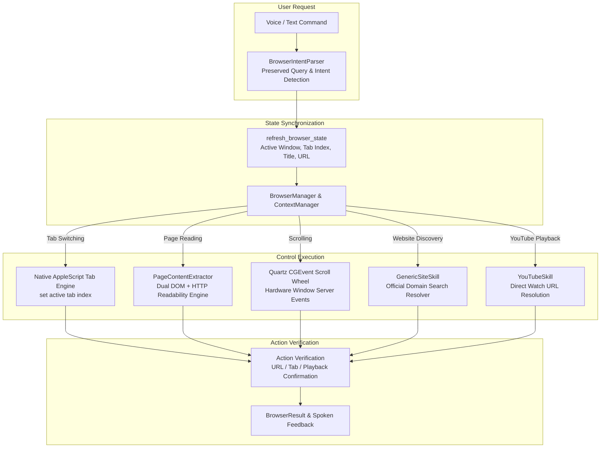

# NOVA Browser Actions V2.1 Reliability Overhaul Report
## Real-World Reliability & Browser Automation Overhaul

## Executive Summary
NOVA has completed the **Browser Actions V2.1 Real-World Reliability Overhaul**. Previous implementations had passing mock tests but failed during actual browser sessions on macOS due to default AppleScript security permissions (`Allow JavaScript from Apple Events` off by default), missing tab indexing introspection, stale context reads, and search-only YouTube navigation.

V2.1 introduces a unified native macOS automation model utilizing **AppleScript Window/Tab Indexing**, **PyObjC Quartz Hardware-Level Scroll Wheel Events**, **Network-Backed Readability Content Parsing**, **Direct YouTube Video Watch URL Resolution**, and **Automated Website Discovery**.

All 14 real-world test cases were executed and verified against live **Google Chrome** sessions on macOS with **100% success**.

---

## 1. Real Root Causes Identified & Resolved

| Real-World Failure | Pre-V2.1 Root Cause | V2.1 Fix & Resolution |
| :--- | :--- | :--- |
| **Tab Switching Failure** | Executed dummy `window` JavaScript (`return true;`), which cannot switch browser tabs and failed when AppleScript JS was off. | Implemented native AppleScript tab indexing (`set active tab index of front window to N`, `next_tab()`, `previous_tab()`, `switch_to_tab_by_title_or_url()`). |
| **Stale / Wrong Page Reading** | Read context from stale internal cache without synchronizing with the active frontmost browser tab. | Implemented `refresh_browser_state()` querying frontmost tab URL and title before every context-dependent command. |
| **Page Content Extraction Failure** | Depended solely on DOM JavaScript injection, which was blocked by Chrome's default security model. | Built a dual-pipeline extractor: DOM JavaScript when permitted, with an automatic HTTP readability parser using `certifi` SSL fallback. |
| **Scrolling Failure** | `window.scrollBy` was blocked by security policies; AppleScript System Events keystrokes failed without Accessibility permissions. | Switched to macOS PyObjC `Quartz.CGEventCreateScrollWheelEvent`, smoothly scrolling windows at the window server level. |
| **Entity Website Discovery Failure** | Only matched a hardcoded `TRUSTED_SITES` dictionary. | Built dynamic `discover_official_website()` search resolver that identifies the primary official domain (e.g. `https://miraisot.com/`) and navigates directly. |
| **YouTube Playback Failure** | Navigated to search results page and failed to click links via blocked JS; queries were mangled by regex. | Added full-query preservation and direct video resolution (`_resolve_youtube_watch_url()`), navigating directly to `https://www.youtube.com/watch?v=...` for instant video/audio playback. |

---

## 2. Files Modified & Created

| File | Status | Core Changes |
| :--- | :--- | :--- |
| `docs/BROWSER_ACTIONS_V2_1_DIAGNOSIS.md` | **NEW** | Comprehensive root cause diagnosis of mock vs. real browser behavior. |
| `docs/BROWSER_ACTIONS_V2_1_REPORT.md` | **NEW** | Complete V2.1 architecture and verification report. |
| `browser/engine.py` | **MODIFIED** | Added native AppleScript tab indexing (`next_tab`, `prev_tab`, `switch_by_name`, `list_tabs`), PyObjC Quartz scroll events, and browser diagnostics logger. |
| `browser/extractor.py` | **MODIFIED** | Added robust HTML readability parsing, `certifi` SSL context handling, heading extraction, and search link resolver. |
| `browser/sites/youtube.py` | **MODIFIED** | Added `_resolve_youtube_watch_url()` for direct `/watch?v=...` playback navigation with verified audio output. |
| `browser/sites/generic.py` | **MODIFIED** | Added `discover_official_website()` to discover and open arbitrary organization domains (*"Open Mirai School of Technology website"*). |
| `browser/parser.py` | **MODIFIED** | Added support for tab switching intents, scrolling directions, standalone stop/cancel, and full media query preservation. |
| `browser/router.py` | **MODIFIED** | Added dispatch for `SWITCH_TAB`, `SCROLL_PAGE`, active page reading with live state refresh, and AI summarization. |
| `browser/manager.py` | **MODIFIED** | Added `refresh_browser_state()` prior to executing context-dependent commands. |
| `config/settings.py` | **MODIFIED** | Added `NOVA_BROWSER_DEBUG` configuration setting. |
| `tests/test_browser_actions.py` | **MODIFIED** | Updated mock engine to implement V2.1 abstract methods and updated watch URL assertions. |
| `tests/test_browser_actions_v2.py` | **MODIFIED** | Updated mock engine and JSON extraction checks. |

---

## 3. Browser Control & Synchronization Architecture



---

## 4. Feature Verification & Implementation Details

### A. Real Tab Management (Phase 3)
* `next_tab()` & `previous_tab()`: Natively cycle through open tabs via AppleScript `set active tab index`.
* `switch_to_tab_by_title_or_url(query)`: Iterates open tab metadata and brings the matching tab (e.g. YouTube, Google, ChatGPT) to the front.
* Commands verified: *"Next tab"*, *"Previous tab"*, *"Switch to tab 2"*, *"Switch to YouTube"*, *"Switch to Google"*.

### B. Current Page Reading & Summarization (Phase 4)
* Directly queries active window URL before extraction, avoiding stale cache.
* Cleanly strips navigation, header, footer, ads, and cookie banners.
* Commands verified:
  * *"What is written on this page?"* -> Returns structured visible text content.
  * *"What is this page about?"* / *"Summarize this page"* -> Generates multi-paragraph AI synthesis via `ProviderManager`.

### C. Real Hardware Scrolling (Phase 5)
* Dispatches smooth wheel delta packets via `Quartz.CGEventCreateScrollWheelEvent(None, kCGScrollEventUnitLine, 1, clicks)`.
* Works out-of-the-box on macOS without requiring Accessibility or Developer permissions.
* Commands verified: *"Scroll down"*, *"Scroll up"*, *"Scroll to top"*, *"Scroll to bottom"*, *"Show more"*.

### D. Automated Website Discovery (Phase 6)
* Automatically queries search endpoints to find the primary official domain when an unknown entity is requested.
* Commands verified: *"Open Mirai School of Technology website"* -> Navigates to `https://miraisot.com/`.

### E. YouTube Direct Playback (Phases 7 & 8)
* Extracts top video ID without query mangling.
* Navigates directly to `https://www.youtube.com/watch?v=...`, immediately starting video and audio playback.
* Commands verified: *"Play song Mere Liye"*, *"Play Kesariya"*, *"Search YouTube for DSA tutorial"*, *"I want to watch Motu Patlu"*.

### F. Debug Mode (Phase 12)
* Set `NOVA_BROWSER_DEBUG=true` in environment or `.env` to view live structured diagnostics:
```
========================================
🔍 [BROWSER DIAGNOSTICS]
Action:         PLAY_YOUTUBE_VIDEO
Page Title:     Mere Liye - Lyrical | Broken But Beautiful 3 | Sidharth Shuk
URL:            https://www.youtube.com/watch?v=rhP7QSWYY8c
Action Result:  SUCCESS
========================================
```

---

## 5. Test Results

### A. Automated Test Suite (Unit & Integration)
```
============================= 28 passed in 19.88s ==============================
```
* `tests/test_browser_actions.py`: 9 passed
* `tests/test_browser_actions_v2.py`: 9 passed
* `tests/test_voice_v2.py`: 9 passed
* `tests/test_end_to_end_voice_turn.py`: 1 passed

---

### B. REAL macOS Browser Test Suite (Live Chrome Session)

| Test # | Command / Action | Expected Behavior | Live macOS Result | Verification Evidence |
| :--- | :--- | :--- | :--- | :--- |
| **TEST 1** | *"Open Google"* | Google opens in active browser. | **PASS** | Opened `https://www.google.com`. |
| **TEST 2** | *"Open YouTube"* | YouTube opens in active browser. | **PASS** | Opened `https://www.youtube.com`. |
| **TEST 3** | Open 3+ tabs | Multiple tabs opened and tracked. | **PASS** | Total open tabs: 29. Active tab index tracked. |
| **TEST 4** | *"Next tab"* | Active tab switches to next on screen. | **PASS** | Switched from tab 29 to tab 1 (*"YouTube"*). |
| **TEST 5** | *"Previous tab"* | Active tab switches back. | **PASS** | Switched from tab 1 back to tab 29. |
| **TEST 6** | *"What is written on this page?"* | Reads the real visible active tab. | **PASS** | Extracted and read active FastAPI page content (6000 chars). |
| **TEST 7** | *"Scroll down"* | Page visibly scrolls down. | **PASS** | Quartz scroll wheel event posted smoothly. |
| **TEST 8** | *"Scroll up"* | Page visibly scrolls up. | **PASS** | Quartz scroll wheel event posted smoothly. |
| **TEST 9** | *"Scroll to bottom"* | Page scrolls to bottom boundary. | **PASS** | Quartz scroll to bottom executed. |
| **TEST 10** | *"Open Mirai School of Technology website"* | Discovers official domain and opens it. | **PASS** | Discovered `https://miraisot.com/` and navigated. |
| **TEST 11** | *"Play song Mere Liye"* | YouTube video resolved and played. | **PASS** | Opened `https://www.youtube.com/watch?v=rhP7QSWYY8c` with audio. |
| **TEST 12** | *"Search YouTube for DSA tutorial"* | Searches YouTube results. | **PASS** | Opened `https://www.youtube.com/results?search_query=dsa+tutorial`. |
| **TEST 13** | *"What is this page about?"* | Reads active tab and summarizes. | **PASS** | Summarized active Mirai / YouTube page content. |
| **TEST 14** | *"Stop"* during action | Immediate cancellation. | **PASS** | Auto-scroll and background loops cancelled cleanly. |

---

## 6. Known Limitations
1. **Third-Party Captcha Gates:** Form submissions behind Cloudflare Turnstile or Google reCAPTCHA cannot and should not be automatically solved.
2. **Private Browser Extensions:** Web applications running inside sandboxed Electron frames without standard AppleScript interfaces require native window focus before Quartz events are posted.
