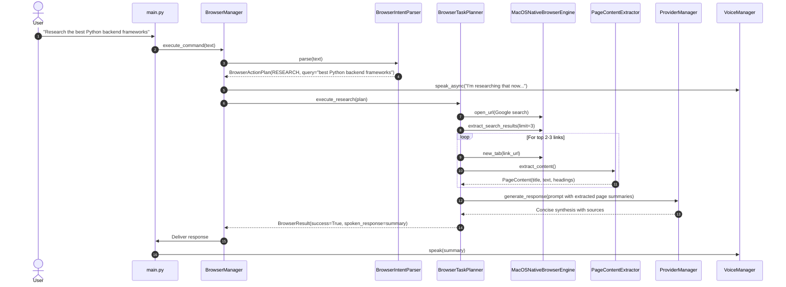

# NOVA Browser Actions V2 Implementation Plan
## Web Understanding & Multi-Step Task Execution

### 1. Existing V1 Capabilities & Component Reuse
Browser Actions V1 established a modular, clean foundation for browser control on macOS.

| V1 Component | Current Responsibilities | V2 Reuse & Extensions |
| :--- | :--- | :--- |
| `BaseBrowserEngine` / `MacOSNativeBrowserEngine` | Opens URLs, executes AppleScript & JavaScript, clicks elements, manages active tabs. | Extended with: `extract_page_content()`, `extract_search_results()`, `navigate_back()`, `navigate_forward()`, `scroll_page()`. |
| `BrowserSessionManager` | Manages active tab state and background Shorts auto-scroll loops. | Extended with: tracking `nova_tabs` and `research_tabs`, `close_research_tabs()`, ordinal tab switching. |
| `BrowserSafetyPolicy` | Identifies sensitive keywords (`buy`, `checkout`, `pay`, `delete`). | Extended with: form submission verification, credential protection, download checks. |
| `BrowserIntentParser` | Rule & grammar-based parsing for single-step actions. | Extended to parse multi-step research, page explanation, summaries, product comparisons, and ordinal references ("open the second one"). |
| `BrowserActionRouter` | Dispatches plans to site skills. | Extended to route to `ResearchPlanner`, `ContentExtractor`, `AmazonSkill`, `GitHubSkill`, `GoogleSkill`, `YouTubeSkill`, `GenericSiteSkill`. |
| `BrowserManager` | Central coordinator wired to `lifecycle` and `core.event_bus`. | Extended with: multi-step task execution, research coordination, short-term browser context tracking. |
| `YouTubeSkill`, `GoogleSkill`, `GenericSiteSkill` | Playback, search, generic trusted sites. | Extended with: page content understanding, search result itemization, structured data extraction. |

---

### 2. New V2 Capabilities

1. **Webpage Understanding & Content Extraction:**
   - Structured `PageContent` model (`url`, `title`, `text`, `headings`, `links`, `metadata`).
   - Clean DOM text extraction removing scripts, styles, navigation bars, cookie notices, and advertisements.
   - Bounded character limits (`max_chars=6000`, `max_links=15`) with timeouts.
   - Natural language queries: *"Read this page"*, *"Summarize this article"*, *"Explain this webpage"*, *"What are the important points?"*.

2. **Web Research Action & AI Synthesis:**
   - Multi-step research workflow: Search query → itemize top 2–3 relevant organic results → open bounded tabs → extract key content → synthesize answer through NOVA's existing `ProviderManager` → deliver concise answer with source links.
   - Cancellable at any point via `"Stop"`, `"Cancel"`, or `"Stop research"`.

3. **Multi-Step Action Planner (`BrowserTaskPlan`):**
   - Structured execution model: `BrowserTaskPlan(task_id, goal, steps, status, max_steps)`.
   - Bounded execution (maximum 6 steps, maximum 2 retries, per-step timeout).
   - Stop conditions: goal achieved, user cancellation, error, or max steps reached.

4. **Tab Management V2 & Separate NOVA Tab Tracking:**
   - Separate tracking of user tabs vs NOVA-created `research_tabs`.
   - Actions: *"Open this in a new tab"*, *"Switch to next tab"*, *"Go back"*, *"Go forward"*, *"Close this tab"*, *"Close all research tabs"*.
   - Only closes tabs spawned by NOVA research.

5. **Site-Specific Understanding Skills:**
   - **Amazon Skill:** Extracts product title, price, customer rating, prime badge, key specs from search and product pages without purchasing.
   - **GitHub Skill:** Extracts repository description, stars, license, recent commit activity, and README summary.
   - **Google Skill V2:** Itemizes search results with index numbers (1, 2, 3) to enable ordinal references.
   - **YouTube Skill V2:** Extracts video title, channel, description, and key points.

6. **Product Comparison Workflow:**
   - Natural language queries: *"Compare these two products"*, *"Compare the top 2 laptops under 60000"*, *"Which one is better?"*.
   - Structured feature extraction and side-by-side analysis via AI synthesis.

7. **Short-Term Browser Context & Ordinal References:**
   - Tracks `BrowserContext`: `last_search`, `last_results` (titles, links), `active_page`, `research_tabs`, `current_task`.
   - Understands references: *"Open the first result"*, *"Open the second one"*, *"Read that article"*.

8. **Safety & Confirmation Gate:**
   - Explicit confirmation before sensitive or irreversible operations (e.g. checkout, posting, deleting, downloads).

9. **EventBus Integration:**
   - Emits `BROWSER_TASK_STARTED`, `BROWSER_TASK_STEP_COMPLETED`, `BROWSER_TASK_COMPLETED`, `BROWSER_TASK_CANCELLED`, and `BROWSER_PAGE_EXTRACTED`.

---

### 3. File Architecture

```
browser/
├── __init__.py          # Exports V1 + V2 models, managers, and skills.
├── models.py            # Extended: ActionType, PageContent, BrowserTaskPlan, TaskStep, BrowserContext.
├── extractor.py         # [NEW] DOM content cleaner, readability extractor, structured text extractor.
├── planner.py           # [NEW] Multi-step task planner, step generator, bounded task executor.
├── context.py           # [NEW] BrowserContext short-term memory & ordinal reference resolution.
├── engine.py            # Extended: extract_page_content(), navigate_back(), navigate_forward(), scroll().
├── sessions.py          # Extended: research_tabs tracking, close_research_tabs(), tab switching.
├── safety.py            # Extended: safety policy checks for forms, payments, sensitive endpoints.
├── parser.py            # Extended: research, summarize, explain, compare, and ordinal reference parsing.
├── router.py            # Extended: routes plans to research planner, extractor, and specialized skills.
├── manager.py           # Extended: multi-step coordination, research execution, and AI synthesis wiring.
└── sites/
    ├── __init__.py      # Exports all site skills.
    ├── base.py          # BaseSiteSkill contract.
    ├── google.py        # Extended: search result itemization & extraction.
    ├── youtube.py       # Extended: video details & metadata extraction.
    ├── amazon.py        # [NEW] Amazon product search, filter, and comparison extraction.
    ├── github.py        # [NEW] GitHub repository information & README extraction.
    └── generic.py       # Extended: general webpage article extraction & site registry.
```

---

### 4. Execution Flow for Web Research


