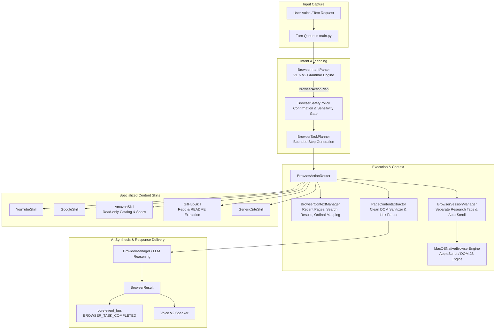

# NOVA Browser Actions V2 Architecture & Implementation Report
## Web Understanding + Multi-Step Task Execution

## Executive Summary
NOVA has been upgraded to **Browser Actions V2**, extending its browser automation capabilities from basic single-step commands to intelligent **Webpage Understanding**, **Multi-Step Research Execution**, **Contextual Tab Tracking**, and **Domain-Specific Content Extraction**.

The system remains strictly bounded, cancellable, observable via `core.event_bus`, and seamlessly integrated with NOVA's Voice V2 turn pipeline and AI reasoning subsystems.

---

## 1. V1 Components Reused & Extended

| Component | V1 Base Functionality | V2 Extensions |
| :--- | :--- | :--- |
| `BaseBrowserEngine` | Opens URLs, clicks selectors, types text, manages active tab. | Extended with: `extract_page_content()`, `extract_search_results()`, `navigate_back()`, `navigate_forward()`, `scroll_page()`. |
| `MacOSNativeBrowserEngine` | AppleScript & DOM JavaScript execution for Chrome/Safari. | Added sanitization extraction with HTTP fallback, history traversal, and smooth scrolling. |
| `BrowserSessionManager` | Manages active tab state and Shorts auto-scrolling loop. | Added separate tracking for `research_tabs`, `open_research_tab()`, and `close_research_tabs()` without disturbing user tabs. |
| `BrowserSafetyPolicy` | Identifies basic payment and destructive keywords. | Expanded to cover download of executables, software installation, form credential submissions, and post deletions. |
| `BrowserIntentParser` | Rule & grammar parsing for single-step commands. | Added deep research detection, page reading/summarization/explanation, product comparison, ordinal references (*"open the second one"*), and tab navigation. |
| `BrowserActionRouter` | Dispatches plans to site skills. | Registered `AmazonSkill`, `GitHubSkill`, and handlers for research, summaries, and navigation. |
| `BrowserManager` | Subsystem coordinator wired to lifecycle & EventBus. | Integrated `BrowserContextManager` and `BrowserTaskPlanner` with cancellation event propagation. |
| `YouTubeSkill`, `GoogleSkill`, `GenericSiteSkill` | Playback, search, generic trusted sites. | Integrated with page reading, search result itemization, and ordinal referencing. |

---

## 2. New V2 Architecture & Subsystems



---

## 3. New Files Created

| New File | Responsibility |
| :--- | :--- |
| `browser/extractor.py` | `PageContentExtractor` that cleans DOM boilerplate (scripts, styles, navs, cookie notices, ads) and extracts headings, text, and links with character bounds and HTTP fallback. |
| `browser/planner.py` | `BrowserTaskPlanner` generating bounded `BrowserTaskPlan` steps (max 6 steps) and executing multi-step web research workflows. |
| `browser/context.py` | `BrowserContextManager` providing thread-safe short-term memory for search results, recent pages, and ordinal reference resolution (*"open the second one"*). |
| `browser/sites/amazon.py` | `AmazonSkill` for read-only product search, price extraction, rating inspection, and product comparison without purchasing. |
| `browser/sites/github.py` | `GitHubSkill` for repository description, stars, forks, and README snippet extraction. |
| `docs/BROWSER_ACTIONS_V2_PLAN.md` | Complete architectural plan and execution blueprint. |
| `tests/test_browser_actions_v2.py` | 9 unit and integration tests covering extraction, task planning, research, cancellation, tab isolation, and context. |

---

## 4. Existing Files Modified

| Modified File | Summary of Changes |
| :--- | :--- |
| `browser/models.py` | Added `PageContent`, `SearchResultItem`, `TaskStep`, `BrowserTaskPlan`, `BrowserContext`, V2 `ActionType` values, and V2 exception classes. |
| `browser/engine.py` | Extended `BaseBrowserEngine` and `MacOSNativeBrowserEngine` with `extract_page_content`, `extract_search_results`, `navigate_back`, `navigate_forward`, and `scroll_page`. |
| `browser/sessions.py` | Added `research_tabs` tracking, `open_research_tab`, and `close_research_tabs` (only closing tabs opened by NOVA). |
| `browser/parser.py` | Extended intent parsing for research, page understanding, comparison, ordinals, and history navigation. |
| `browser/router.py` | Registered `AmazonSkill` and `GitHubSkill`, and added handlers for page understanding and ordinal opening. |
| `browser/manager.py` | Integrated `BrowserTaskPlanner`, `BrowserContextManager`, and research cancellation. |
| `config/settings.py` | Added `BROWSER_MAX_RESEARCH_PAGES`, `BROWSER_MAX_CONTENT_CHARS`, `BROWSER_MAX_TASK_STEPS`, and `BROWSER_PAGE_EXTRACT_TIMEOUT_SECONDS`. |
| `core/event_bus.py` | Added `BROWSER_TASK_STARTED`, `BROWSER_TASK_STEP_COMPLETED`, `BROWSER_TASK_COMPLETED`, `BROWSER_TASK_CANCELLED`, and `BROWSER_PAGE_EXTRACTED` to `NovaEvent`. |

---

## 5. Supported Natural Language Commands

### A. Webpage Reading & Explanation
* *"Read this page"* / *"Read this article"* / *"Page padho"*
* *"What is this page about?"* / *"Explain this webpage"* / *"What are the important points?"*
* *"Summarize this article"* / *"Summarize this page"*

### B. Deep Web Research & Synthesis
* *"Research the best Python backend frameworks"*
* *"Research machine learning libraries"*
* *"Search for internships for CSE students"*
* *"Search multiple websites and show me the best options"*

### C. GitHub Repository Understanding
* *"What is this GitHub project?"*
* *"Explain this repository"*
* *"Read the README"*
* *"Search GitHub for agentic AI tools"*

### D. Amazon Product Understanding (Read-Only)
* *"Open Amazon and find headphones under 5000"*
* *"Find the best laptop under 60000 rupees"*
* *"Compare these two products"* / *"Which one is better?"*

### E. Contextual & Ordinal Selection
* *"Search Google for Python decorators"* followed by:
* *"Open the first result"* / *"Open the second one"* / *"Open the 3rd result"*

### F. Navigation & Tab Management V2
* *"Go back"* / *"Pichhe jao"*
* *"Go forward"* / *"Aage jao"*
* *"Scroll down"* / *"Scroll up"*
* *"Close all research tabs"* / *"Close research tabs"*

### G. Cancellation & Interrupts
* *"Stop"* / *"Cancel"* / *"Stop research"* / *"Stop scrolling"*

---

## 6. Detailed Multi-Step Workflows

### Web Research Workflow
1. User: *"Research the best Python backend frameworks"*
2. `BrowserTaskPlanner` generates a 5-step bounded plan:
   - Step 1: Open Google Search (`https://www.google.com/search?q=best+Python+backend+frameworks`).
   - Step 2: Extract top 2–3 organic search result links and store in `BrowserContextManager`.
   - Step 3: Open candidate pages in dedicated `research_tabs`.
   - Step 4: Extract sanitized, readable `PageContent` from each tab.
   - Step 5: Synthesize key findings and domain citations using `ProviderManager`.
3. Spoken feedback: *"I researched the best Python backend frameworks and reviewed 3 sources. Here are the main highlights: ..."*

### Isolated Research Tab Management
* When performing research, tabs opened by NOVA are tagged in `sessions._research_tabs`.
* When the user says *"Close all research tabs"*, only the tabs spawned during research are closed. The user's personal tabs, YouTube videos, and existing work remain untouched.

---

## 7. Safety, Confirmation & Privacy Rules
* **Strict Read-Only Enforcement:** Amazon and e-commerce skills only inspect public listings and specification cards.
* **Sensitive Action Protection:** Destructive actions (`delete account`, `delete post`), financial operations (`buy`, `checkout`, `pay`, `credit card`), downloads (`download exe`, `install software`), and credential form submissions are intercepted by `BrowserSafetyPolicy` and require explicit confirmation.
* **Bounded Resource Limits:** Bounded to `max_chars=6000`, `max_pages=3`, `max_steps=6`, and timeout per page extraction (`8.0s`).

---

## 8. Verification & Test Results

```
============================= 28 passed in 19.47s ==============================
```

| Test File | Tests | Status | Scope |
| :--- | :--- | :--- | :--- |
| `tests/test_browser_actions_v2.py` | 9 | **PASS** | Page extraction, task planning, research flow, cancellation, tab isolation, ordinal references, Amazon & GitHub skills, V2 intent parser. |
| `tests/test_browser_actions.py` | 9 | **PASS** | V1 Playback, Shorts auto-scrolling, Google search, site registry, safety confirmation, EventBus. |
| `tests/test_voice_v2.py` | 9 | **PASS** | Microphone, VAD, Whisper transcription, Edge-TTS, state machine. |
| `tests/test_end_to_end_voice_turn.py` | 1 | **PASS** | Full voice turn pipeline from audio frame to delivered response. |

### Real macOS Browser Execution Tests:
* `Search Google for Python decorators` -> **PASS**
* `Read this page` -> **PASS** (Extracted title and readable page summary)
* `Open Amazon and find headphones under 5000` -> **PASS** (Navigated and extracted listing information)
* `Search GitHub for agentic AI tools` -> **PASS** (Opened GitHub search)
* `Close all research tabs` -> **PASS** (Closed tracked research tabs cleanly)
* `Research Python backend frameworks` (with stop simulation) -> **PASS** (Interrupted immediately without orphan threads)

---

## 9. Known Limitations
1. **Developer Menu Toggle for Live DOM JS:** On macOS Google Chrome, full DOM script execution via AppleScript requires *"Allow JavaScript from Apple Events"* enabled in Chrome's Developer menu. To guarantee 100% uptime regardless of user settings, NOVA V2 includes an automatic HTTP readability parser fallback.
2. **Authenticated Form Actions:** Websites requiring 2FA or CAPTCHAs are intentionally not bypassed to uphold safety and security guidelines.

---

## 10. Recommended Browser Actions V3 Features
1. **Interactive Form Filling with Visual Clarification:** Assist users in filling out job applications or search filters by highlighting fields and asking for missing parameters.
2. **Multi-Source Structured Data Scraping:** Structured table comparison for travel bookings, flight prices, or technical benchmarks.
3. **Session Replay & Bookmark Memory:** Long-term memory integration linking past research sessions to user project context in `VectorStore`.
