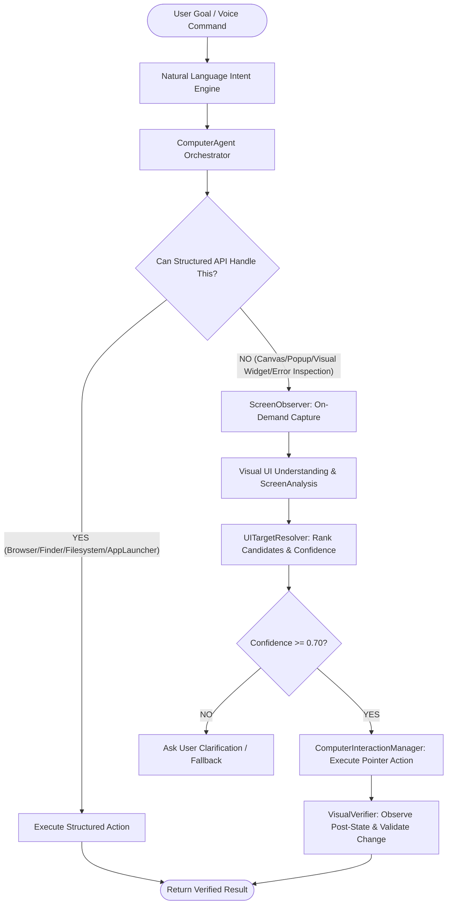

# NOVA Computer Agent V2 Diagnosis: Visual Interaction & Smart UI Control

## Executive Summary
NOVA currently possesses robust Voice V2 orchestration, Natural Language Action Understanding, deterministic Environment Awareness V1, safe filesystem operations, and structured Browser Automation. However, when an application does not expose structured DOM or AppleScript hooks—such as custom desktop apps, web canvases, unscriptable dialogs, popups, or non-standard UI widgets—NOVA cannot visually locate or interact with visible elements on screen.

Computer Agent V2 introduces an **ON-DEMAND visual inspection & safe pointer control system** adhering to:
$$\text{OBSERVE} \longrightarrow \text{UNDERSTAND} \longrightarrow \text{PLAN} \longrightarrow \text{ACT} \longrightarrow \text{VERIFY}$$

---

## 1. Existing Capabilities in NOVA
- **Environment Awareness V1 (`core/environment.py`)**: `EnvironmentContext`, `EnvironmentObserver`, and `ContextResolver` offering real-time app/URL/window/Finder tracking and 3-tier pronoun resolution.
- **Natural Language Intent Engine (`intent/`)**: Hierarchical normalizer, linguistic matcher, and canonical intent classification.
- **Browser Automation (`browser/`)**: Multi-step web research, in-site search, YouTube Shorts navigation, DOM extraction, and session management.
- **Desktop Actions V1 (`desktop/`)**: App launching/closing, safe directory operations, document synthesis via `ProviderManager`, and camera management.
- **Screen Recording (`core/screen_recording.py`)**: Native `screencapture -v` in background process groups with clean `SIGINT` flushing.
- **Safety Policies (`desktop/safety.py`)**: Path boundary containment and destructive action confirmation loops.
- **Lifecycle & Event Bus (`core/lifecycle.py`, `core/event_bus.py`)**: Thread-safe service registry, event broadcasting, and shutdown hooks.

---

## 2. Reusable Components
1. **`EnvironmentContext` & `EnvironmentObserver`**: Must be refreshed before every visual observation to capture active application, frontmost window title, screen dimensions, and last action context.
2. **`ProviderManager`**: Provides multimodal reasoning and LLM explanation for visual error understanding ("Explain this error", "What error is on my screen?") and UI element classification.
3. **`TextNormalizer` & `CanonicalIntent`**: Normalizes voice inputs, strips wake words, and extracts parameters.
4. **`DesktopSafetyPolicy`**: Enforces strict confirmation requirements before any destructive actions (e.g. deleting files, submitting irreversible forms).
5. **`EventBus`**: Emits visual lifecycle events (`VISUAL_OBSERVATION_STARTED`, `UI_ACTION_EXECUTED`, `VISUAL_VERIFICATION_COMPLETED`).

---

## 3. Missing Capabilities in Existing System
1. **On-Demand Visual Observation (`ScreenObserver`)**: No dedicated manager for taking bounded, task-specific screenshots with cryptographic snapshot hashing and metadata tracking.
2. **Structured UI Parsing (`ScreenAnalysis`)**: No data schema to represent buttons, text inputs, menus, dialogs, error banners, and bounding boxes.
3. **UI Target Resolution & Ranking (`UITargetResolver`)**: No fuzzy matching engine to rank UI candidates (`"Click search"` vs `"Click the login button"` vs `"Click the second result"`) with confidence tiers (HIGH, MEDIUM, LOW).
4. **Safe Pointer & Keystroke Execution (`ComputerInteractionManager`)**: No native Quartz/PyObjC event poster to execute validated clicks, double clicks, right clicks, scrolling, text typing, and key shortcuts safely within active screen boundaries.
5. **Post-Action Verification (`VisualVerifier`)**: No comparative verification step to confirm that a click actually altered the screen state (e.g. opened a dialog, changed button state, or navigated) before claiming success.
6. **Screen Staleness Protection (`ScreenSnapshot`)**: No mechanism to verify that the active window and screen hash haven't changed between observation and mouse click.

---

## 4. Risks of Coordinate-Based Clicking & Mitigations

| Risk | Cause | Mitigation in V2 |
| :--- | :--- | :--- |
| **Stale Click Danger** | User changes window or page scrolls after observation | `ScreenSnapshot` validation checks window title, active PID, and timestamp freshness (< 5.0s) before executing any click. If stale, re-observe. |
| **Off-Screen Out of Bounds** | Invalid bounding box or multi-monitor coordinate mismatch | `ComputerInteractionManager` clamps and validates every $(x, y)$ coordinate against `Quartz.CGDisplayPixelsWide` & `CGDisplayPixelsHigh`. |
| **Misclick on Destructive UI** | Vision AI misidentifies "Delete" or "Format" button | Destructive actions always require explicit user confirmation regardless of visual confidence. |
| **Hallucinated Coordinates** | LLM outputs arbitrary $(x, y)$ numbers | LLM never outputs raw click coordinates; coordinates are derived solely from validated bounding box centers detected in `ScreenAnalysis`. |
| **Infinite UI Loops** | Agent repeatedly clicks an unresponsive element | Hard bounded retries (maximum 3 attempts) and cancellation support. |

---

## 5. Structured-First Fallback Architecture

Visual interaction is an **augmentation**, NOT a replacement for structured APIs:

---

## 6. Recommended Implementation Modules
- `visual/models.py`: Data structures (`ScreenSnapshot`, `UIElement`, `UIElementType`, `ScreenAnalysis`, `VisualActionPlan`, `VisualResult`, `VisualConfidence`).
- `visual/observer.py`: `ScreenObserver` on-demand screen/window/region capture and snapshot metadata hashing.
- `visual/analysis.py`: `ScreenAnalyzer` combining accessibility UI tree extraction with OCR/multimodal reasoning.
- `visual/resolver.py`: `UITargetResolver` fuzzy matching labels, roles, and ordinals with confidence scoring.
- `visual/interaction.py`: `ComputerInteractionManager` Quartz pointer & keyboard event synthesis with boundary guards.
- `visual/verifier.py`: `VisualVerifier` pre- vs post-state comparative diffing.
- `core/computer_agent.py`: `ComputerAgent` central orchestrator coordinating structured fallback vs visual execution.
