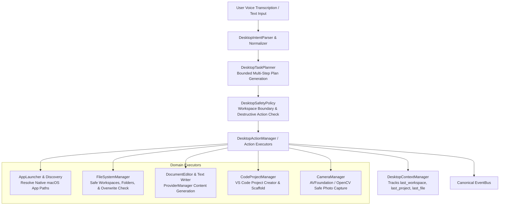

# NOVA Desktop Actions V1 Architecture & Implementation Plan

## Executive Summary
NOVA Desktop Actions V1 extends NOVA's local automation capabilities by providing safe, structured, and natural language-driven desktop automation, file/project generation, application control, text/code writing, and camera integration on macOS.

It builds on top of the existing `MacControlManager`, `NaturalLanguageIntentEngine`, `ProviderManager`, `EventBus`, and `Lifecycle` subsystems without duplicating code or creating competing systems.

---

## 1. Existing Components Reused

| Component | Location | Role in Desktop Actions V1 |
| :--- | :--- | :--- |
| **EventBus** | `core.event_bus` | Emits canonical `DESKTOP_ACTION_*` and `CAMERA_CAPTURE_*` events. |
| **ProviderManager** | `core.registry` / `providers.manager` | Generates AI text content (e.g. leave applications, essays) and code (e.g. Python calculator, C++ algorithms) separated from desktop execution. |
| **NaturalLanguageIntentEngine** | `intent.engine` | Normalizes speech and classifies structured intent and parameters. |
| **MacControlManager** | `mac_control.manager` | Hardware volume/brightness/app control integrated with desktop action routing. |
| **Service Registry** | `core.registry` | Manages `desktop_manager` lifecycle alongside `browser_manager` and `voice_manager`. |

---

## 2. New Subsystem Architecture: `desktop/`

### Module Structure:
* `desktop/models.py`: Structured data models (`DesktopActionType`, `DesktopActionPlan`, `DesktopResult`, `DesktopTaskPlan`, `DesktopStep`).
* `desktop/safety.py`: Workspace boundary verification, sensitive file path protection, and explicit overwrite/deletion confirmation.
* `desktop/context.py`: Short-term desktop context manager (`last_workspace`, `last_project`, `last_file`, `last_app`).
* `desktop/apps.py`: Dynamic macOS application discovery, alias mapping (*"VS Code"* $\rightarrow$ *"Visual Studio Code"*, *"Notepad"* $\rightarrow$ *"TextEdit"*), and process verification.
* `desktop/files.py`: Safe directory/file creation, nested tree generation (e.g. `DSA/` with `Arrays/`, `LinkedList/`, `Trees/`), and non-destructive overwrite guards.
* `desktop/editor.py`: AI-assisted document writing (generating text via `ProviderManager` and writing to documents or opening TextEdit).
* `desktop/code.py`: Code scaffolding & project creation (e.g. `index.html`, `style.css`, `app.js`, C++ projects, Python scripts) and VS Code launcher.
* `desktop/camera.py`: Explicit camera photo capture saving to `~/Pictures/NOVA/` with AVFoundation/OpenCV verification.
* `desktop/planner.py`: Multi-step planner executing composite requests (e.g. *"Create a folder called CP, create main.cpp and open in VS Code"*).
* `desktop/parser.py`: Intent parser mapping natural commands to structured desktop actions.
* `desktop/manager.py`: High-level `DesktopActionManager` coordinating all desktop capabilities.

---

## 3. Safety Boundaries
1. **Approved Workspace Directory:** Default operations are restricted to `~/Desktop/NOVA_WORKSPACE/` (configurable in `config/settings.py`).
2. **Never Silent Overwrite:** Existing files trigger confirmation or versioned naming before write.
3. **No Automatic Code Execution:** Generated code files are created and inspected, but never automatically run or executed without user command.
4. **Explicit Camera Activation:** Camera capture is strictly triggered upon explicit commands (*"Take a picture"*, *"Click my photo"*), never in background loops.
5. **Bounded Execution:** Multi-step plans have `max_steps=10` and are cancellable via `stop_active_task()` or *"Nova stop"*.
