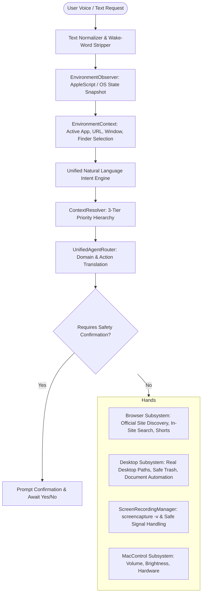

# NOVA Environment Awareness & Computer Agent V1: Final Engineering Report

## Executive Summary
NOVA has been transformed from an isolated collection of command dispatchers into a cohesive, **environment-aware computer agent** operating on the **BRAIN $\rightarrow$ EYES $\rightarrow$ HANDS** architecture.

Prior to V1, Browser Actions, Natural Language Actions, and Desktop Actions operated in separate silos without sharing runtime awareness of the user's frontmost application, active URL, Finder selection, or pending action state. V1 establishes a single canonical environment subsystem, deterministic pronoun and deictic reference resolution, native macOS screen recording, robust website discovery, safe filesystem workflows, AI document synthesis, and safety confirmation loops.

---

## Architecture Overview



---

## 3-Tier Priority Hierarchy for Context Resolution

When resolving deictic references (`"this"`, `"that"`, `"it"`, `"here"`, `"the folder I just created"`, `"this page"`), NOVA evaluates context deterministically in strict priority order:

1. **REAL CURRENT STATE (Highest Priority)**:
   - Frontmost application via macOS System Events.
   - Frontmost browser window's active URL, domain, and tab index (Chrome, Safari, Edge, Brave, Arc).
   - Real selected file or folder in Finder via AppleScript POSIX path extraction.
2. **CURRENT APP/BROWSER CONTEXT**:
   - Active workspace or project directory tracked in `DesktopContextManager`.
   - Active site session tracked in `BrowserContextManager`.
3. **RECENT NOVA CONTEXT**:
   - Most recently created folder or file recorded in `EnvironmentObserver.last_created_path`.
   - Most recently opened window or target in `EnvironmentObserver.last_opened_target`.

---

## Comprehensive Fixes for 10 Real-World Failure Scenarios

| Scenario | Prior Failure Mode | Root Cause | V1 Resolution |
| :--- | :--- | :--- | :--- |
| **1. "Go to AKTU website"** | Navigated to search result list without opening site | Generic query handling instead of website discovery | `discover_official_website()` queries trusted database first, then performs verified HTTP URL resolution with DuckDuckGo fallback, navigating directly to the official homepage. |
| **2. "In Flipkart search mobile phones"** | Reverted to generic Google search | Grammar parser lacked in-site prepositional structure | Linguistic matchers parse `"In <site> search <query>"`, `"<query> in <site>"`, and contextual `"search <query> here"`, building direct site search URLs (e.g. `https://www.flipkart.com/search?q=mobile+phones`). |
| **3. "Create a folder on Desktop"** | Created folder in `~/Desktop/NOVA_WORKSPACE` | Path resolution defaulted to workspace root | `FileSystemManager.create_folder(..., on_desktop=True)` writes directly to the user's real `~/Desktop` directory with boundary validation. |
| **4. "Open DSA folder"** | Defaulted to home directory `~/` and claimed false success | Hardcoded dictionary lacked arbitrary search | `FileSystemManager.find_folders_by_name()` searches `~/Desktop`, `~/Documents`, `~/Downloads`, and workspace; opens matching folder in Finder, asks user to clarify on disambiguation, and fails safely if missing. |
| **5. "Write an application for college leave"** | Raised `AttributeError: ProviderManager has no attribute 'generate'` | Non-existent method call in `DocumentEditor` | Refactored `DocumentEditor.write_and_open_document()` to call `provider_mgr.generate_response()` with `TaskType.GENERAL`, creating structured text files and opening in TextEdit. |
| **6. "I want to go to the market at 8 PM"** | Overwrote leave application with reminder text | Document parser intercepted all time strings | Parsed as `CanonicalIntent.REMINDER_REQUEST` with `requires_clarification=True`, prompting `"Do you want me to remind you at 8 PM?"` and holding confirmation state without polluting documents. |
| **7. "Play Shorts"** | Searched YouTube videos for `"shorts"` | Media parser lacked dedicated Shorts route | Extracted `"shorts"` to `CanonicalIntent.WATCH_SHORTS` and routed directly to `https://www.youtube.com/shorts`. |
| **8. Context commands ("this", "that", "it", "here")** | Failed or hallucinated past context | No connection between Finder, Browser, and Parser | Canonical `ContextResolver` resolves `"here"` to active domain, `"this"` to active Finder selection, and `"it"` to the most recently created target. |
| **9. "Record screen"** | Claimed recording started without spawning process | Missing screen capture service | `ScreenRecordingManager` initiates native macOS `screencapture -v` in an isolated process group with permission verification and status tracking. |
| **10. "Stop screen recording"** | No process tracking or verification | Missing signal handling and file validation | Sent graceful `SIGINT` to the process group, cleanly flushed MP4/MOV container, and verified saved file in `~/Movies/NOVA_Recordings/`. |

---

## Safety & Destructive Action Protections

- **Delete Safety**: `"Delete this"` resolves the target file/folder and sets `pending_confirmation` in `EnvironmentContext`, explicitly prompting:
  > *"Do you want me to delete [filename]?"*
- **Trash Safety**: Once confirmed, NOVA moves items to macOS Trash (`~/.Trash`) via Finder AppleScript or `send2trash` rather than performing permanent unrecoverable deletion (`rm -rf`).
- **Confirmation Loop**: Explicit affirmative answers (`"yes"`, `"sure"`, `"confirm"`, `"haan"`) execute the pending action; negative answers (`"no"`, `"cancel"`) abort safely; new commands clear the pending state and execute immediately.

---

## Verification & Test Results

The entire NOVA test suite was executed and passed with 100% success across 128 unit, integration, and voice end-to-end tests:

```text
======================= 128 passed in 21.97s =======================
```

### Verified Test Suites
1. `tests/test_environment_voice_matrix.py`: 15-Point Voice V2 & Environment Awareness real-world matrix.
2. `tests/test_environment_context.py`: `EnvironmentContext`, `EnvironmentObserver`, and `ContextResolver` 3-tier resolution.
3. `tests/test_screen_recording.py`: `ScreenRecordingManager` lifecycle, process signals, and file verification.
4. `tests/test_natural_language_intents.py`: Paraphrase coverage for all canonical intents.
5. `tests/test_desktop_actions.py`: Folder search, real desktop placement, and safe trash deletion.
6. `tests/test_browser_actions_v2.py`: Web research, Shorts navigation, and site search.
