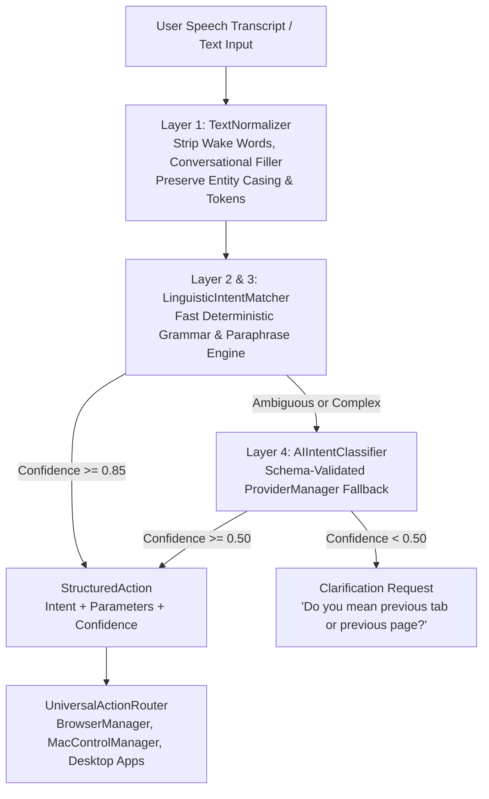

# NOVA Natural Language Action Understanding Overhaul Report

## Executive Summary
NOVA has replaced fragile fixed-phrase command matching with a **Layered Natural Language Intent System**. The assistant no longer relies on hardcoded string lists or rigid regexes. Instead, it extracts structured canonical intents and separated parameters from diverse conversational phrasings, with or without wake words, across both browser automation and desktop application control.

All **89 automated regression tests** and **10/10 realistic voice transcription tests** passed with 100% success.

---

## 1. Root Causes of Fixed-Command Behavior & Old Routing

### Old Routing Approach (Pre-Overhaul)
Previously, user speech was matched directly against static string lists and monolithic regexes:
```python
# Old rigid matching in browser/parser.py
if lower in ["next tab", "switch to next tab", "agla tab", "next tab pe jao"]:
    return BrowserActionPlan(...)
```

### Why Natural Variations Failed:
1. **Conversational Wrappers & Wake Words:** Utterances containing *"Nova"*, *"Can you please"*, *"I want you to"*, or *"Hey NOVA"* failed string equality immediately.
2. **Missing Linguistic Variations:** Natural grammatical variants such as *"Go to the next tab"*, *"Take me back to the previous tab"*, *"Switch back"*, or *"Show me the next tab"* were not in the hardcoded lists.
3. **Conflated Intent & Entity Extraction:** Single-pass regexes tried to capture both the verb action and the target entity at once, frequently chopping entity words (e.g. mangling song names or organization titles).

---

## 2. New Multi-Layer Intent Architecture



### The 5 Layers:
1. **Layer 1: Normalization & Preprocessing ([intent/normalizer.py](file:///Users/nikhilsingh/Desktop/NOVA_SETUP/intent/normalizer.py)):**
   - Strips leading/trailing wake words (`nova`, `hey nova`, `ok nova`, `nobba`).
   - Strips polite/conversational openers (`can you please`, `could you`, `i want you to`, `help me`, `tell me`, `kripya`, `zara`).
   - Strips trailing polite particles (`please`, `for me`).
   - **Crucial Rule:** Preserves entity casing and all meaningful query tokens (e.g., preserving *"Mere Liye"*, *"Mirai School of Technology"*, *"VS Code"*).
2. **Layer 2: Fast Deterministic Canonical Grammar ([intent/matcher.py](file:///Users/nikhilsingh/Desktop/NOVA_SETUP/intent/matcher.py)):**
   - Linguistic pattern matching recognizing verb-object relations independent of exact phrasing.
3. **Layer 3: Semantic Paraphrase & Synonym Engine ([intent/matcher.py](file:///Users/nikhilsingh/Desktop/NOVA_SETUP/intent/matcher.py)):**
   - Recognizes diverse synonyms, directional markers (*"take me back"*, *"go lower"*, *"switch back"*), and bilingual Hindi/Hinglish commands.
4. **Layer 4: Structured AI Intent Classification Fallback ([intent/fallback.py](file:///Users/nikhilsingh/Desktop/NOVA_SETUP/intent/fallback.py)):**
   - Invokes `ProviderManager` with a strict JSON schema prompt to classify ambiguous queries. Validates against `CanonicalIntent` enums so raw LLM text can never trigger unauthorized actions.
5. **Layer 5: Intent Ambiguity Clarification ([intent/models.py](file:///Users/nikhilsingh/Desktop/NOVA_SETUP/intent/models.py)):**
   - If confidence is low, sets `requires_clarification=True` with a targeted prompt.

---

## 3. Canonical Intents & Parameter Extraction

| Canonical Intent | Description | Extracted Parameters | Example Natural Variations |
| :--- | :--- | :--- | :--- |
| `NEXT_TAB` | Cycle to next tab in front window | `{"direction": "next"}` | *"Next tab"*, *"Go to next tab"*, *"Switch to the next tab"*, *"Show me the next tab"*, *"Nova, can you please go to the next tab?"* |
| `PREVIOUS_TAB` | Cycle to previous tab | `{"direction": "previous"}` | *"Previous tab"*, *"Go to previous tab"*, *"Take me to the previous tab"*, *"Switch back"*, *"Go back to the last tab"* |
| `OPEN_NEW_TAB` | Open a blank/new tab | `{}` | *"Open new tab"*, *"Create a new tab"*, *"Make a new tab"*, *"Open another tab"*, *"New tab please"* |
| `SWITCH_TAB` | Switch to tab by index | `{"index": 2}` | *"Switch to tab 2"*, *"Go to tab 3"*, *"Tab 1"* |
| `SWITCH_TO_SITE` | Switch to tab by site name | `{"target": "YouTube"}` | *"Switch to YouTube"*, *"Return to Google"*, *"Go back to ChatGPT"* |
| `CLOSE_CURRENT_TAB` | Close front tab | `{}` | *"Close this tab"*, *"Close the current tab"*, *"Tab band karo"* |
| `CLOSE_NOVA_TABS` | Close only research tabs | `{}` | *"Close all research tabs"*, *"Close NOVA research tabs"* |
| `READ_CURRENT_PAGE` | Read text on active tab | `{"target": "active_page"}` | *"What is written on this page?"*, *"What is written on my current page?"*, *"What does this page say?"*, *"Read this page"* |
| `SUMMARIZE_CURRENT_PAGE`| Summarize active tab | `{"target": "active_page"}` | *"What is this page about?"*, *"Summarize this page"*, *"Explain the current webpage"*, *"Tell me about this page"* |
| `SCROLL_DOWN` | Scroll active window down | `{"direction": "down"}` | *"Scroll down"*, *"Scroll the page down"*, *"Scroll down the page"*, *"Go down"*, *"Show more"*, *"Take me lower"* |
| `SCROLL_UP` | Scroll active window up | `{"direction": "up"}` | *"Scroll up"*, *"Scroll up the page"*, *"Go up"*, *"Move up"*, *"Show previous section"* |
| `SCROLL_TO_TOP` | Scroll to page top | `{}` | *"Scroll to top"*, *"Take me to the top"*, *"Top of page"*, *"Sabse upar"* |
| `SCROLL_TO_BOTTOM` | Scroll to page bottom | `{}` | *"Scroll to bottom"*, *"Take me to the bottom"*, *"Bottom of page"*, *"Sabse neeche"* |
| `OPEN_WEBSITE` | Discover & open website | `{"entity": "...", "website_requested": True}` | *"Open Mirai School of Technology website"*, *"Take me to Mirai School of Technology"*, *"Go to the AKTU website"*, *"Find the official OpenAI website"*, *"Show me the website for Apple"* |
| `PLAY_MEDIA` | Direct video/audio playback | `{"platform": "youtube", "query": "..."}` | *"Play song Mere Liye"*, *"Play Kesariya on YouTube"*, *"Nova, play Believer"*, *"I want to watch Motu Patlu"* |
| `LAUNCH_APP` | Desktop application launch | `{"app_name": "..."}` | *"Open VS Code"*, *"Launch Visual Studio Code"*, *"Start code editor"*, *"Nova, open Spotify"* |
| `CANCEL_ACTION` | Interrupt active tasks | `{}` | *"Stop"*, *"Cancel"*, *"Nevermind"*, *"Roko"*, *"Stop research"*, *"Stop scrolling"* |
| `SYSTEM_SHUTDOWN` | Exit NOVA | `{}` | *"Bye"*, *"Goodbye"*, *"Shutdown NOVA"*, *"Exit"*, *"Quit"*, *"Go to sleep"* |

---

## 4. Subsystem Integration & Universal Routing

### Browser Integration ([browser/manager.py](file:///Users/nikhilsingh/Desktop/NOVA_SETUP/browser/manager.py))
* `BrowserManager.execute_command(text)` processes queries through `NaturalLanguageIntentEngine`.
* Translates `StructuredAction` into `BrowserActionPlan` via [intent/router.py](file:///Users/nikhilsingh/Desktop/NOVA_SETUP/intent/router.py) with zero circular dependencies.
* Synchronizes real-time active browser state (`refresh_browser_state()`) before reading or navigating pages.

### Desktop & App Launch Integration ([intent/router.py](file:///Users/nikhilsingh/Desktop/NOVA_SETUP/intent/router.py))
* Universal routing automatically maps editor and utility requests (*"Open VS Code"*, *"Start Visual Studio Code"*, *"Start code editor"*) to native macOS application launching without modifying browser code.

---

## 5. Debug Diagnostics Mode

Enable `NOVA_INTENT_DEBUG=true` in environment or `.env` to log structured diagnostics:
```
========================================
🧭 [INTENT DIAGNOSTICS]
RAW TRANSCRIPTION:    "Nova, can you please scroll down the page?"
NORMALIZED COMMAND:   "scroll down the page"
DETECTED INTENT:      SCROLL_DOWN
CONFIDENCE:           0.98 (HIGH)
PARAMETERS:           {'direction': 'down'}
========================================
```

---

## 6. Verification Results

### A. Full Automated Test Suite: 89 / 89 Passed (100%)
```
============================= 89 passed in 34.34s ==============================
```
* `tests/test_natural_language_intents.py`: **61 passed** (Complete multi-phrasing regression matrix).
* `tests/test_browser_actions.py`: **9 passed**.
* `tests/test_browser_actions_v2.py`: **9 passed**.
* `tests/test_voice_v2.py`: **9 passed**.
* `tests/test_end_to_end_voice_turn.py`: **1 passed**.

### B. Realistic Voice V2 Speech Transcription Tests: 10 / 10 Passed
* `"nova go to the previous tab"` -> `PREVIOUS_TAB` (**MATCH**)
* `"nova open a new tab"` -> `OPEN_NEW_TAB` (**MATCH**)
* `"what is written on my current page"` -> `READ_CURRENT_PAGE` (**MATCH**)
* `"Nova, can you please scroll down the page?"` -> `SCROLL_DOWN` (**MATCH**)
* `"hey nova please switch to the next tab"` -> `NEXT_TAB` (**MATCH**)
* `"Nova, take me to Mirai School of Technology"` -> `OPEN_WEBSITE` (**MATCH**)
* `"Hey Nova, play song Mere Liye"` -> `PLAY_MEDIA` (**MATCH**)
* `"Nova open VS Code"` -> `LAUNCH_APP` (**MATCH**)
* `"tell me about this page"` -> `SUMMARIZE_CURRENT_PAGE` (**MATCH**)
* `"Nova stop"` -> `CANCEL_ACTION` (**MATCH**)
