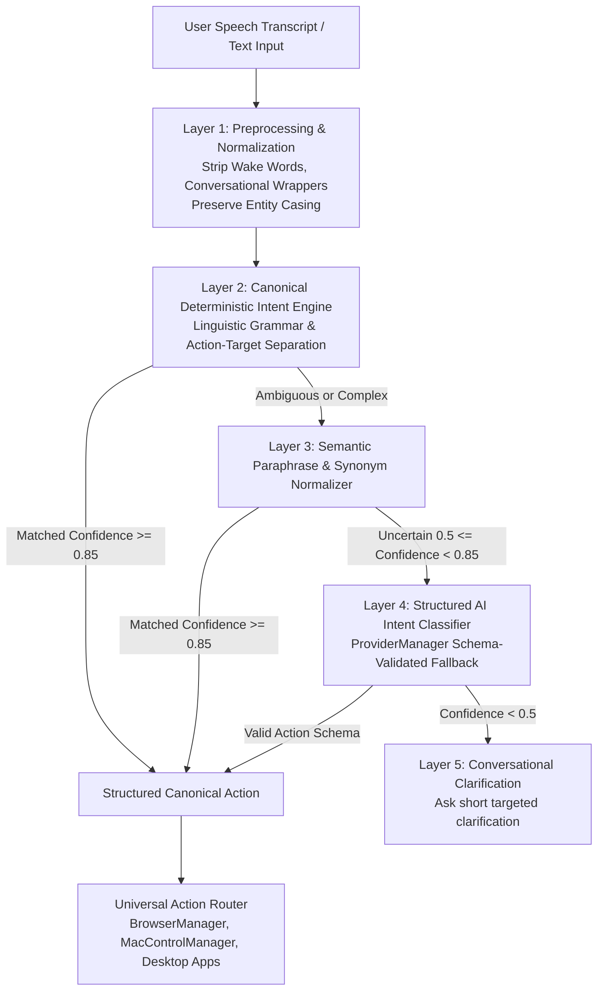

# NOVA Natural Language Action Understanding Diagnosis

## Executive Summary
This audit inspects how natural language commands, speech transcripts, and browser/system actions are currently parsed, routed, and executed across NOVA. It identifies the root architectural limitations of fixed-phrase keyword matching and explains why natural language paraphrases fail despite correct user intent.

---

## 1. Commands Dependent on Exact Phrase Matching

### A. Tab Switching Commands in `browser/parser.py`
```python
if lower in ["next tab", "switch to next tab", "agla tab", "next tab pe jao"]:
    return BrowserActionPlan(action_type=ActionType.SWITCH_TAB, query="next", ...)

if lower in ["previous tab", "prev tab", "switch to previous tab", "pichhla tab", "go back to the previous tab"]:
    return BrowserActionPlan(action_type=ActionType.SWITCH_TAB, query="previous", ...)
```
* **Why it fails:**
  - *"Go to the next tab"* -> **FAILS** (contains the article "the").
  - *"Show me the next tab"* -> **FAILS** (verb phrase "show me" is not in list).
  - *"Move to the next tab"* -> **FAILS** (verb "move" is not in list).
  - *"Switch back"* -> **FAILS** (not in list).
  - *"Take me back to the previous tab"* -> **FAILS** (prefix "take me back to" is not in list).
  - *"Go to previous tab"* -> **FAILS** (missing from exact equality list).

### B. Current Page Reading & Understanding in `browser/parser.py`
```python
if any(p in lower for p in [
    "what is written on this page",
    "what is on this page",
    "read this page",
    "read the page",
    "read this article",
    "read the article",
    "page padho",
    "what is written here",
]):
    return BrowserActionPlan(action_type=ActionType.READ_PAGE, ...)
```
* **Why it fails:**
  - *"What is written on my current page?"* -> **FAILS** ("my current page" vs "this page").
  - *"What am I looking at?"* -> **FAILS** (unmatched idiom).
  - *"Tell me what is on this page"* -> **FAILS** (unmatched conversational prefix).
  - *"Can you read this website?"* -> **FAILS** ("website" vs "page").
  - *"Explain the page I am currently viewing"* -> **FAILS**.

### C. Website & Entity Discovery
```python
m_site_entity = re.search(r"^(?:open|find|launch|go\s+to)\s+(?:the\s+)?(?:official\s+)?(?:website\s+of\s+)?(.+?)(?:\s+website|\s+site)?$", lower)
```
* **Why it fails:**
  - *"Take me to Mirai School of Technology"* -> **FAILS** ("take me to" was not in regex prefix).
  - *"Show me the website for Apple"* -> **FAILS** ("website for" was not accounted for).
  - *"Can you open the GitHub website?"* -> **FAILS** (conversational filler "Can you" not stripped).

### D. Wake Word & Conversational Wrappers
* When a user speaks via Voice V2:
  - Transcript: *"Nova, next tab"* or *"Hey NOVA, can you please go to the next tab"*
  - The literal string begins with `"nova"` or `"hey nova"`.
  - Because `lower in [...]` does exact equality checks against `"next tab"`, any utterance containing the assistant's name or polite filler fails immediately!

---

## 2. Parameter Extraction & Separation Failures

* **Conflation of Intent and Entities:**
  Currently, action parsers attempt to extract both the action and the target entity in a single monolithic regex pass. If any particle differs (e.g. *"website of"*, *"website for"*, *"page on"*, *"song called"*), the capture group either grabs excess tokens or fails completely.
* **Loss of Meaningful Entity Content:**
  In some historical regexes, greedy matching trimmed entity tokens (e.g. converting *"Play song Mere Liye"* into *"Mere"* or stripping non-English titles).

---

## 3. Layered Natural Language Solution (V2.2 Architecture)

To resolve these issues permanently, we replace rigid phrase lists with a **5-Layer Natural Language Action Understanding Pipeline**:



### Key Principles:
1. **Never match raw sentences against static strings.**
2. **Normalize conversational fluff and wake words before intent classification.**
3. **Separate Canonical Intent (`CanonicalIntent.NEXT_TAB`) from Parameters (`target`, `query`, `platform`).**
4. **Universal Reuse:** The same intent pipeline classifies browser commands, macOS system commands (volume, brightness), and app launches ("Open VS Code" / "Start code editor").
