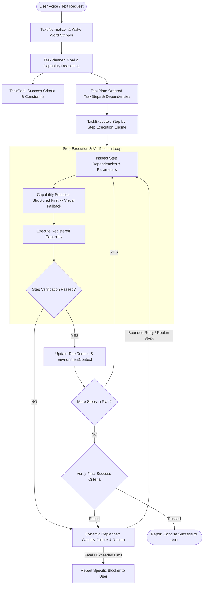

# NOVA Autonomous Task Agent V3 Diagnosis: Goal Planning, Multi-Step Execution & Dynamic Replanning

## Executive Summary
NOVA currently possesses reliable single-turn execution capabilities across Browser Actions, Desktop Actions, Environment Awareness V1, and Visual UI Control (Computer Agent V2). However, real-world user requests are rarely single-turn commands. When a user asks:
> *"Create a DSA project on Desktop with arrays and trees folders, then add main.cpp inside arrays."*
or
> *"Find a Python tutorial and save the useful link in a text file."*

The existing system attempts to parse the prompt into a single `CanonicalIntent` or fails due to inter-step dependencies, lack of step-by-step verification, absence of a dynamic replanner when a sub-action encounters an unexpected UI state, and lack of persistent task-level context (`TaskContext`).

Autonomous Task Agent V3 introduces a **structured multi-step goal execution system**:
$$\text{USER GOAL} \longrightarrow \text{UNDERSTAND OUTCOME} \longrightarrow \text{STRUCTURED PLAN} \longrightarrow \text{STEP-BY-STEP EXECUTE \& VERIFY} \longrightarrow \text{DYNAMIC REPLAN} \longrightarrow \text{FINAL GOAL VERIFY} \longrightarrow \text{REPORT}$$

---

## 1. Existing Capabilities & Capability Registry

| Capability Name | Subsystem | Input Schema | Expected Output | Verification Method | Risk Level | Cancellation |
| :--- | :--- | :--- | :--- | :--- | :--- | :--- |
| `fs.create_folder` | Desktop/Files | `name: str, on_desktop: bool, parent_path: str?` | `folder_path: Path` | `folder_path.is_dir()` | LOW | Supported |
| `fs.create_file` | Desktop/Files | `name: str, content: str, parent_path: str?` | `file_path: Path` | `file_path.is_file()` | LOW | Supported |
| `fs.safe_move_to_trash` | Desktop/Files | `target_path: Path` | `trashed: bool` | `not target_path.exists()` | HIGH (Requires Conf.) | Supported |
| `doc.write_and_open` | Desktop/Editor | `topic: str, app_name: str` | `doc_path: Path` | Process open & file exists | LOW | Supported |
| `app.launch` | Desktop/Apps | `app_name: str` | `launched: bool` | System Events PID check | LOW | Supported |
| `app.close` | Desktop/Apps | `app_name: str` | `closed: bool` | System Events PID absence | MEDIUM | Supported |
| `browser.open_site` | Browser | `target_url: str` | Tab loaded | URL / Tab Title match | LOW | Supported |
| `browser.search_web` | Browser | `query: str, engine: str` | Search page loaded | DOM URL / Title match | LOW | Supported |
| `browser.search_site` | Browser | `site: str, query: str` | Site results page | Site URL / Results DOM | LOW | Supported |
| `browser.watch_shorts` | Browser | - | Shorts feed | YouTube Shorts URL | LOW | Supported |
| `browser.extract_content` | Browser | - | Page text / markdown | Text length > 0 | LOW | Supported |
| `screen.record_start` | Core/Screen | - | Process spawned | `ScreenRecordingManager.is_recording` | LOW | Supported |
| `screen.record_stop` | Core/Screen | - | `.mov` video file | File exists & size > 0 | LOW | Supported |
| `visual.click_element` | Visual/V2 | `target_label: str` | Pointer click sent | Post-snapshot image hash diff | MEDIUM | Supported |
| `visual.type_text` | Visual/V2 | `text: str, target_label: str?` | Keystrokes sent | Input text focus / change | LOW | Supported |
| `visual.close_popup` | Visual/V2 | - | Dialog dismissed | Post-snapshot diff / escape | LOW | Supported |
| `visual.scroll_until` | Visual/V2 | `target_text: str, max_scrolls: int` | Text visible | Target text in screen analysis | LOW | Supported |
| `visual.explain_error` | Visual/V2 | - | AI explanation text | Explanation string length > 0 | LOW | Supported |

---

## 2. Identified Deficiencies in V2 System
1. **Single-Action Horizon**: `NaturalLanguageIntentEngine` maps inputs to exactly one `StructuredAction`, failing on compound and multi-phase goals.
2. **Missing Plan Structure**: No formal `TaskGoal`, `TaskPlan`, or `TaskStep` schema specifying dependencies (`depends_on`), step-level verifications, and bounded retry counters.
3. **No Intermediate Task Memory (`TaskContext`)**: When a previous step creates a folder (e.g. `DSA_Project`), subsequent steps (e.g. `"create main.cpp inside it"`) lack structured parameter binding (`parent_path = context.created_folders["DSA_Project"]`).
4. **Fragile Error Handling**: If an intermediate step fails, execution halts immediately without attempting alternative structured capabilities or dynamic replanning.
5. **No Final Goal Verification**: Completion is assumed if individual steps run without raising fatal exceptions, rather than verifying holistic success criteria (e.g. all 3 directories and files exist at their target paths).

---

## 3. Autonomous Task Agent V3 Architecture

---

## 4. Capability Selection & Fallback Hierarchy
For every planned step, NOVA strictly follows the 4-tier capability hierarchy:
1. **Tier 1: High-Reliability Structured API** (Direct filesystem operations, system APIs, direct URL navigation).
2. **Tier 2: Existing NOVA Subsystems** (BrowserManager DOM interactions, DesktopActionManager).
3. **Tier 3: Accessibility Tree Integration** (AppleScript System Events UI querying).
4. **Tier 4: Computer Agent V2 Visual Interaction** (On-demand `ScreenObserver` $\rightarrow$ `ScreenAnalysis` $\rightarrow$ `ComputerInteractionManager` Quartz pointer clicks).

---

## 5. Failure Classification & Recovery Strategies

| Failure Type | Root Cause | Recovery Strategy |
| :--- | :--- | :--- |
| `TRANSIENT` | Network timeout, temporary app freeze | Re-observe state, wait 0.5s, retry step (max 2 retries). |
| `NOT_FOUND` | Directory, file, UI button, or tab not found | Search wider safe roots or fallback from structured to visual UI search. |
| `PERMISSION` | Protected directory or ungranted accessibility | Report exact permission failure to user; do not loop. |
| `AMBIGUOUS` | Multiple matching folders or duplicate UI targets | Prompt user for verbal clarification; hold step state. |
| `CANCELLED` | User said "Stop", "Cancel", or "Never mind" | Abort remaining steps immediately; preserve completed work; do not clean up completed steps unless requested. |

---

## 6. Safety & Confirmation Guarantees
- Any plan step marked `requires_confirmation=True` (e.g. trashing items, modifying critical configurations) prompts the user verbally before execution.
- Destructive actions never execute automatically during replanning without re-verifying explicit user consent.
- Path operations are strictly validated against `DesktopSafetyPolicy` safe roots (`~/Desktop`, `~/Documents`, `~/Downloads`, workspace).
