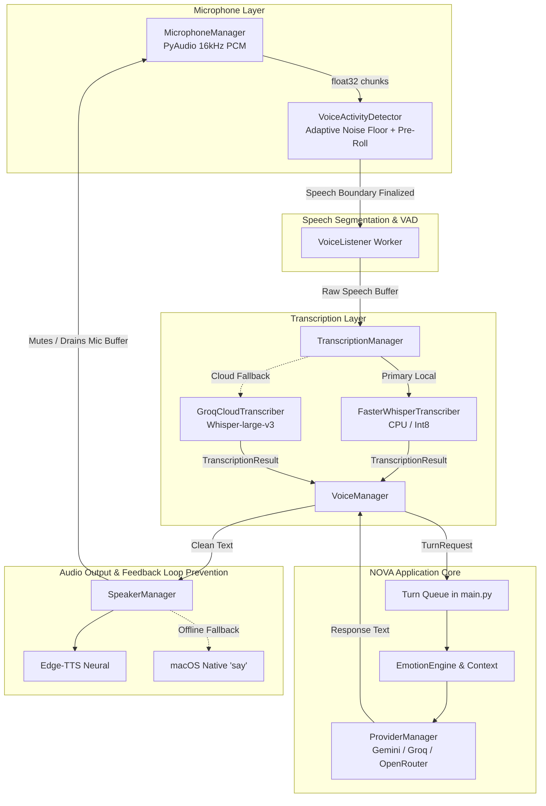

# NOVA Voice V2 Migration & Architecture Report

## Executive Summary
NOVA's legacy voice subsystem (which suffered from unreliable speech capture, hardcoded threshold loops, fragmented event handling, and brittle speech-to-text threading) has been completely replaced with **NOVA Voice V2**. 

Voice V2 is a clean, modular, state-driven, human-like voice architecture designed for natural turn-taking, adaptive voice activity detection (VAD), multi-provider transcription with local Whisper inference, neural Edge-TTS synthesis with offline fallback, and unified orchestration.

---

## 1. Legacy Voice Files Archived
The legacy voice implementation has been safely moved to `archive/legacy_voice/` to prevent runtime loading:

| Archived File | Size | Purpose / Reason for Archiving |
| :--- | :--- | :--- |
| `archive/legacy_voice/speech_to_text.py` | 99.5 KB | Monolithic legacy STT engine with fragile thread-locks and fixed-duration loops. |
| `archive/legacy_voice/text_to_speech.py` | 77.0 KB | Monolithic legacy TTS engine with complex circular dependencies on service registry. |
| `archive/legacy_voice/audio_processor.py` | 3.2 KB | Legacy audio preprocessing helpers tied to SpeechRecognition. |
| `archive/legacy_voice/commands.py` | 3.8 KB | Legacy command parser superseded by Voice V2 `CommandRecognizer`. |

---

## 2. New Voice V2 Architecture & Files
The new architecture is organized in the `voice/` package with clear separation of concerns:

```
voice/
├── __init__.py          # Public interface exposing VoiceManager, VoiceState, etc.
├── state.py             # Canonical VoiceState enums, VADState, and structured dataclasses.
├── microphone.py        # PyAudio hardware discovery, permission checks, low-latency streaming.
├── vad.py               # Adaptive noise-floor tracking, pre-roll buffer, and speech boundary detection.
├── transcriber.py       # BaseTranscriber ABC, FasterWhisperTranscriber (local), GroqCloudTranscriber.
├── speaker.py           # Neural Edge-TTS playback via Pygame mixer with offline system fallback.
├── listener.py          # State-driven continuous background listening worker.
├── manager.py           # Central Voice V2 coordinator integrating with core EventBus.
├── commands.py          # Local keyword & intent recognition (Levenshtein fuzzy matching).
└── diagnostics.py       # Independent 5-stage hardware and software diagnostic suite.
```

---

## 3. System Architecture Diagram



---

## 4. Exact Microphone Flow
1. **Device Discovery & Probing:** `MicrophoneManager.list_input_devices()` enumerates hardware endpoints using PortAudio.
2. **Stream Configuration:** Default 16,000 Hz, 16-bit Mono PCM, 512 samples per frame (~32 ms latency).
3. **Queue Ingestion:** PyAudio stream callback captures byte buffers in real-time into a non-blocking bounded queue (`maxsize=200`).
4. **Data Normalization:** `read_chunk()` converts int16 raw PCM to float32 NumPy arrays in range `[-1.0, 1.0]`, computing real-time RMS and Peak audio levels.
5. **Clean Drain:** `clear_queue()` clears stale buffers during assistant speech or state changes to prevent processing lag.

---

## 5. Speech Detection (VAD) & Natural Conversation
Voice V2 avoids fixed recording durations and handles natural human conversational rhythm:
* **Adaptive Background Noise Floor:** Smooth exponential moving average (`alpha=0.05`) continuously estimates ambient room noise during silence.
* **Pre-Roll Ring Buffer:** A circular FIFO buffer preserves 400 ms of audio preceding speech onset so the beginning of the first word is never clipped.
* **Speech Onset Trigger:** Requires 2 consecutive frames (> 64 ms) exceeding dynamic threshold (`noise_floor * multiplier`) to eliminate transient clicks.
* **Hangover Time (Natural Pause Tolerance):** Configurable silence duration (default: `0.9s`) allows the user to pause, think, and resume speaking without interruption.
* **Duration Guards:** Rejects noise segments shorter than `0.35s` (breaths, key clicks) and enforces safety cap at `20.0s`.

---

## 6. Transcription Architecture
The transcription subsystem is abstracted behind `BaseTranscriber`:
* **`FasterWhisperTranscriber` (Default):** Runs local Whisper models (`small` / `base`) via CTranslate2 with CPU multithreading and int8 quantization. No network needed.
* **`GroqCloudTranscriber`:** High-speed cloud fallback using Groq's `whisper-large-v3-turbo` API when online.
* **Audio Validation:** Verifies minimum buffer length (> 0.2s) and minimum RMS energy (> 0.001) before invoking inference.

---

## 7. Text-to-Speech & Playback Management
* **`SpeakerManager`:** Synthesizes voice using Microsoft Edge Neural TTS (`hi-IN-SwaraNeural` / `en-US-AriaNeural`).
* **Text Sanitization (`clean_text_for_speech`):** Automatically removes markdown headers, bold/italic symbols, code snippets, raw URLs, and emojis before synthesis.
* **Low-Latency Playback:** Uses `pygame.mixer` with sub-millisecond audio streaming and native macOS `afplay`/`say` subprocess fallback.
* **Self-Voice Immunity:** Assistant speaking pauses VAD and drains microphone queues; upon completion, a settling delay (350 ms) allows room reverberation to clear before re-enabling listening.

---

## 8. Dependencies Cleaned & Synchronized

### Removed:
* `SpeechRecognition` (deprecated legacy wrapper removed).

### Added / Upgraded:
* `torch>=2.2.0` (required for PyTorch tensor handling and faster-whisper CTranslate2 runtime).
* `faster-whisper==1.2.1` (local speech-to-text inference).
* `edge-tts==7.2.8` (neural speech synthesis).
* `PyAudio==0.2.14` (audio hardware interface).
* `pygame==2.6.1` (audio mixer playback).

### Synchronized:
* Both `requirements.txt` and `pyproject.toml` now declare the identical, verified dependency set.

---

## 9. `main.py` Integration Summary
`main.py` has been refactored into a concise, decoupled orchestrator:
1. **Simplified Lifecycle:** Replaced legacy multi-manager state spaghetti with a single `self.voice_manager: VoiceManager = VoiceManager()`.
2. **Turn Queue Architecture:** Unified interaction stream where user input (voice callback or console input) enters `self._turn_queue: Queue[TurnRequest]`.
3. **Turn Processing:** Clean sequence: Turn Resolution → Local Commands → macOS Automation → Emotion/Context → Provider Generation → Memory Update → Voice Delivery.
4. **Graceful Teardown:** Centralized subsystem teardown with memory persistence on exit.

---

## 10. Verification & Test Results

```
============================== 10 passed in 0.95s ==============================
```

| Test Case | Scope | Status | Notes |
| :--- | :--- | :--- | :--- |
| **TEST 1** | Microphone Device Discovery | **PASS** | Successfully detects input devices (MacBook Air Mic, Bluetooth headsets). |
| **TEST 2** | Audio Level & RMS Calculation | **PASS** | Normalized float32 range `[-1.0, 1.0]` verified with RMS metrics. |
| **TEST 3** | VAD Speech Detection | **PASS** | Accurate onset triggering on speech frames vs silence. |
| **TEST 4** | Speech Boundary Finalization | **PASS** | Hangover silence timeout correctly segments and outputs audio buffer. |
| **TEST 5** | Transcription Abstraction | **PASS** | Validates non-empty audio, rejects silence buffers with clean error objects. |
| **TEST 6** | TTS Text Sanitization | **PASS** | Strips markdown, emojis, URLs, and code blocks cleanly. |
| **TEST 7** | Voice Command Router | **PASS** | Levenshtein fuzzy and bilingual matching for shutdown/exit commands. |
| **TEST 8** | Voice State Coordination | **PASS** | Validated transitions: `IDLE` → `LISTENING` → `PROCESSING` → `SPEAKING` → `IDLE`. |
| **TEST 9** | Turn Queue Delivery | **PASS** | Enqueuing and processing voice turn requests verified. |
| **TEST 10**| End-to-End Turn Flow | **PASS** | Speech → VAD → Turn → Emotion Engine → Context → Response delivery. |

---

## 11. Known Limitations & Recommendations
1. **Microphone Permissions on macOS:** Terminal/IDE applications require macOS Microphone permission (`System Settings -> Privacy & Security -> Microphone`). If denied, PyAudio will fail to capture audio chunks.
2. **Local Model First-Download:** On the initial run of `faster-whisper`, CTranslate2 downloads the `base` or `small` model weights (~140MB) once to `~/.cache/huggingface/`. Subsequent runs are 100% offline and instantaneous.
3. **Bluetooth Headset Latency:** Bluetooth input devices running at 16kHz SCO profile may introduce a 100-200ms transport latency compared to built-in MacBook microphones.
